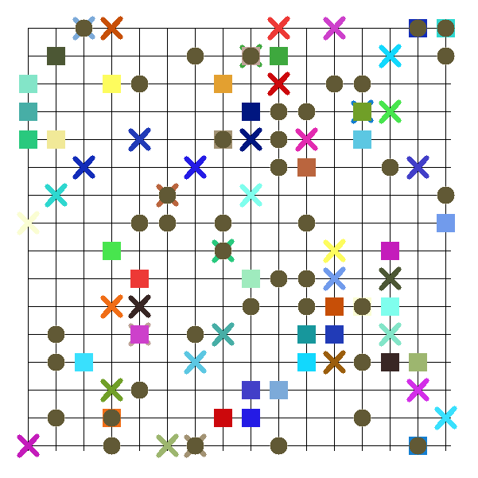
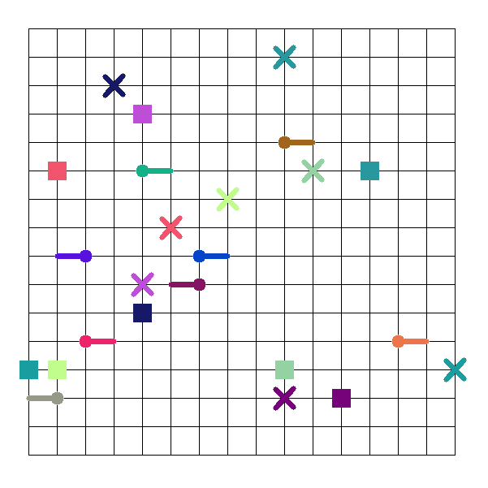

## MATP-solver

#### Simulator

- collision check

- path step

- random initial states or given states

  

#### Traditional method 

- Seperate A* algorithem

  
  
- Confict-based Search

  

- Stupid-avoid

  

#### Learning method

- A3C
- Dueling Double DQN

## 多机器人搬运问题

#### Definition

- 目标：多机器人搬运货物至对应颜色的目标点，完成货物分配以及路径规划使得最后达到的机器人所用时间最短
- 问题简化
  - 将机器人简化为质点，不考虑机器人的运动学模型，并且只能沿着直线的四个方向前进
  - 机器人搬运货物不会导致运动性能发生改变
  - 机器人数量与货物数量相同
- 问题求解
  - 分配问题
    - 假设有n个机器人和货物，构建n*n的代价矩阵，矩阵的值为机器人搬运相应货物抵达终点的最小曼哈顿距离。利用贪婪的想法，每次去掉矩阵中最大的数，直到某一个货物或者机器人存在一一对应关系。
  - 路径规划问题
    - 传统方法
      - 分布式
      - 集中式
    - 强化学习方法
      - 单体训练
      - 多机器人同时训练