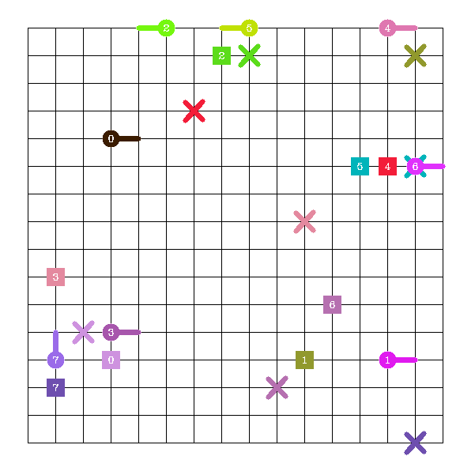
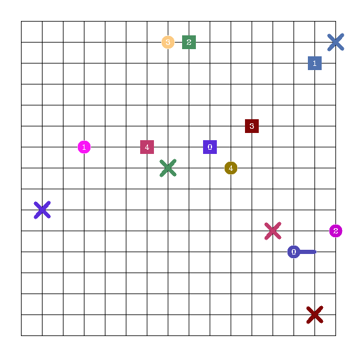
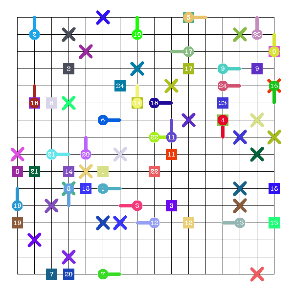

## MATP-solver

#### Simulator

- collision check

- path step

- random initial states or given states

  

#### Traditional method 

- Seperate A* algorithem

  
  
- Confict-based Search

  

- Stupid-avoid

  

#### Learning method

- A3C
- Dueling Double DQN

