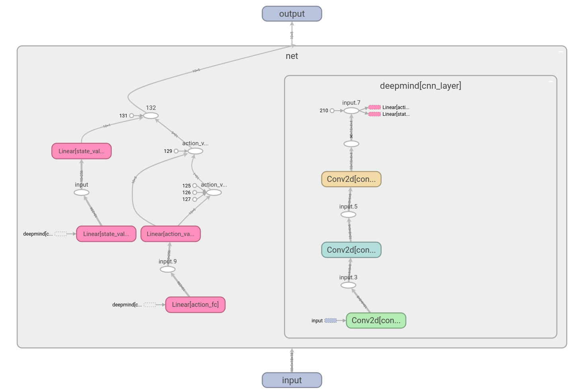
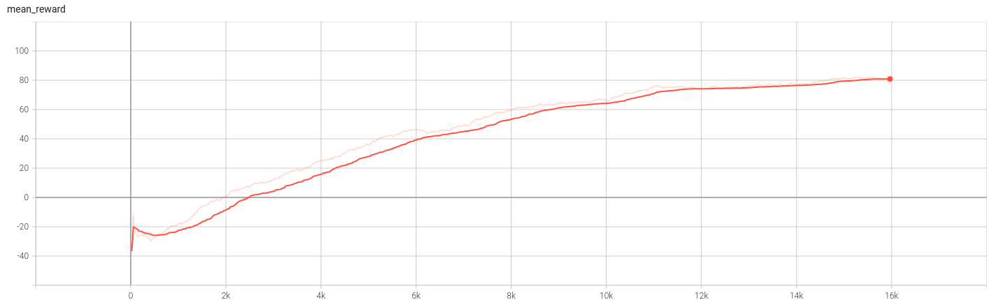

## 多机器人搬运问题

#### Definition

- 目标：多机器人搬运货物至对应颜色的目标点，完成货物分配以及路径规划使得最后达到的机器人所用时间最短
- 问题简化
  - 将机器人简化为质点，不考虑机器人的运动学模型，并且只能沿着直线的四个方向前进
  - 机器人搬运货物不会导致运动性能发生改变
  - 机器人数量与货物数量相同
- 问题求解
  - 分配问题
    - 假设有n个机器人和货物，构建n*n的代价矩阵，矩阵的值为机器人搬运相应货物抵达终点的最小曼哈顿距离。利用贪婪的想法，每次去掉矩阵中最大的数，直到某一个货物或者机器人存在一一对应关系。
  - 路径规划问题
    - 传统方法
      - 分布式
      - 集中式
    - 强化学习方法
      - 单体训练
      - 多机器人同时训练

#### 仿真环境编写

- 仿真环境包括机器人以及目标的可视化，机器人的碰撞检测，机器人运动路径的步进可视化，机器人和目标的随机初始化以及强化学习环境构建
- 整个地图大小为16*16，随机初始化不会发生位置重叠

#### 强化学习算法

- Dueling Double Deep Q-Learning
  - [Paper] https://ojs.aaai.org/index.php/AAAI/article/view/11757
  - 网络
    - 模型输入为每个机器人各自的状态图，由于对于每个机器人问题结构都是相同的，所以我们将状态叠放在一块做成一个batch并行前向传播
    - 模型输入如下图所示，3.0为其他机器人的位置，4.0为目标位置，-1.0为机器人所在位置，当机器人到达终点时，机器人所在位置的值为2，发生碰撞时为-2
    - 
    - 模型结构分为卷积神经网络和全连接两部分，由于输入的是一张图，所以我们采用卷积神经网络对图像进行特征提取，主要希望它能得到其他机器人的相对位置以及目标点的相对位置，然后利用全连接神经网络输出五个动作（四个方向加上原地不动）的Qfunction，借助贪婪策略取最大Q值的动作。
  - Reward 函数设计
    - 为了鼓励机器人迅速到点，单步reward默认为-1
    - 出界或者发生碰撞reward -= 20
    - 到达目标点reward += 100
  - Double Net 防止Q-function的过估计，Dueling 将Q-function拆解为advantage以及value两部分，利用advantage可以减小自举算法的方差
  - 

- A3C
  - 网络以及Reward与Dueling Double Deep Q-Learning基本相同
  - 不同点在于作为Actor-crtic算法，A3C输出的动作概率，它和DQN所要拟合的目标并不相同。因此它的loss function也与DQN不同
  - 此外A3C最大的优势在于通过同时跑多个进程并行地进行探索和学习并定期进行模型的同步，所以训练速度很快，但是同步的机制极大地决定了算法的稳定性

#### 强化学习训练过程

- 训练过程采用tensorboard进行可视化
- 为了保证算法的稳定性，我们先训练单个机器人在没有障碍物的情况下到达目标点，之后引入固定位置的机器人作为障碍物训练机器人完成避障，最后在实际场景中验证模型
- 单体训练过程如图
- 